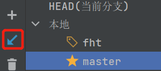
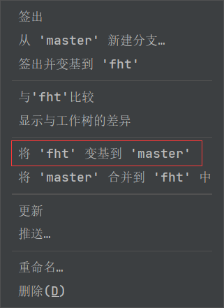
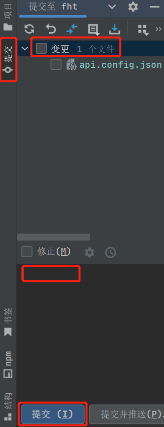
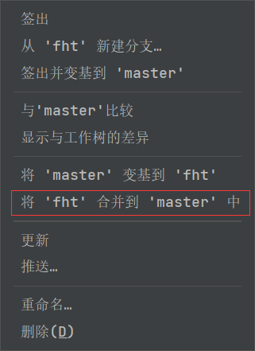
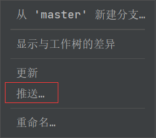

# book(gauss)-vue

图书管理系统前端项目

## How to run

https://github.com/HavEWinTao/Book-Gauss.git

### 1.安装Nodejs(v14.15.4)

下载对于版本的[Nodejs](https://nodejs.org/en/download/)

### 2.安装vue-cli(v4.5.11)

```
# 安装完Nodejs之后，命令行执行
npm install -g @vue/cli@4.5.11
```

### 3.下载依赖(第一次)
```
# 进入项目文件夹，执行
npm install
```

### 4.运行项目

```
npm run serve
```

## 分支管理

建议统一在idea中的git图形界面中操作

每次```git pull```,拉取最新的代码（其他人可能有更改）



切换到自己的分支```git checkout fht```，如果没有就从master分出一个



写代码

本地提交



切换到master并将自己的分支合并到master中



将master推送到仓库


